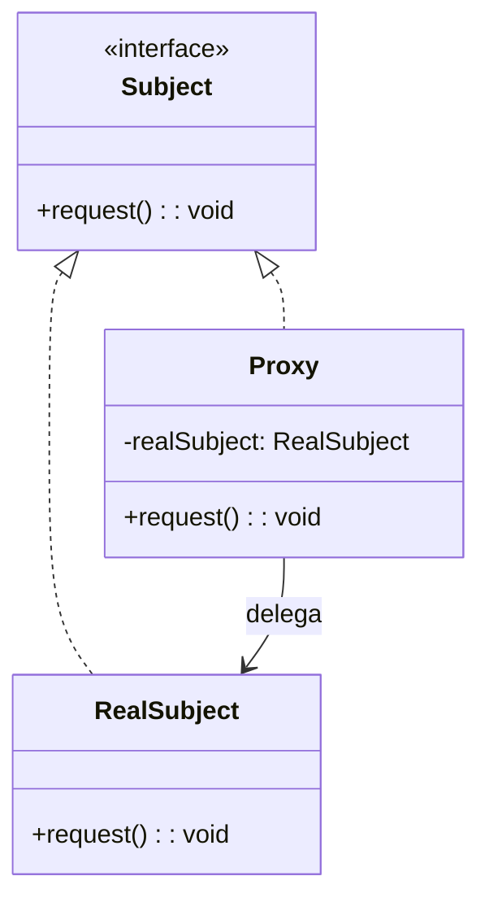

# Proxy

## Intenção
Fornecer um substituto ou intermediário para controlar o acesso a um objeto. O Proxy atua como um representante do objeto real, permitindo adicionar lógica adicional antes ou depois das chamadas ao objeto original, como controle de acesso, carregamento sob demanda ou cache.


## Também conhecido como
Surrogate

## Motivação
Imagine que um sistema de armazenamento em nuvem precisa fornecer acesso a arquivos grandes. Se cada solicitação acessasse diretamente os arquivos na nuvem, poderia haver um alto custo em desempenho e tempo de resposta. Para otimizar esse acesso, podemos usar o padrão Proxy para carregar os arquivos sob demanda e armazená-los temporariamente.

Sem o Proxy, cada vez que um cliente solicita um arquivo, a operação pode ser cara e demorada. O Proxy pode intermediar essas solicitações, verificando permissões, armazenando arquivos acessados recentemente e otimizando chamadas.

## Solução com Proxy:
O padrão Proxy resolve o problema ao intermediar o acesso ao objeto real, permitindo controle sobre sua criação, acesso e manipulação. Assim:

- Podemos adiar a criação do objeto real até que seja realmente necessário.
- Podemos adicionar um cache ou verificação de permissões antes de permitir o acesso ao objeto real.
- Podemos limitar o acesso ao objeto real baseado em regras de negócio.


## Estrutura UML




## Tipos de Proxy 

### 1. Proxy Virtual
Adia a criação e o carregamento de objetos pesados até que sejam realmente necessários.

#### Exemplo:
```java
interface Imagem {
    void exibir();
}

class ImagemReal implements Imagem {
    private String arquivo;

    public ImagemReal(String arquivo) {
        this.arquivo = arquivo;
        carregarImagemDoDisco();
    }

    private void carregarImagemDoDisco() {
        System.out.println("Carregando " + arquivo);
    }

    public void exibir() {
        System.out.println("Exibindo " + arquivo);
    }
}

class ProxyImagem implements Imagem {
    private ImagemReal imagemReal;
    private String arquivo;

    public ProxyImagem(String arquivo) {
        this.arquivo = arquivo;
    }

    public void exibir() {
        if (imagemReal == null) {
            imagemReal = new ImagemReal(arquivo);
        }
        imagemReal.exibir();
    }
}


public class Main {
    public static void main(String[] args) {
        Imagem imagem = new ProxyImagem("foto.jpg");
        System.out.println("Imagem criada");
        imagem.exibir();
    }
}
```

### 2. Proxy de Proteção (Protection Proxy)
Restringe o acesso a um objeto com base em permissões.

#### Exemplo:
```java
interface Documento {
    void exibir();
}

class DocumentoReal implements Documento {
    private String conteudo;

    public DocumentoReal(String conteudo) {
        this.conteudo = conteudo;
    }

    public void exibir() {
        System.out.println("Conteúdo do documento: " + conteudo);
    }
}

class ProxyDocumento implements Documento {
    private DocumentoReal documentoReal;
    private String usuario;

    public ProxyDocumento(String usuario, String conteudo) {
        this.usuario = usuario;
        this.documentoReal = new DocumentoReal(conteudo);
    }

    public void exibir() {
        if (usuario.equals("admin")) {
            documentoReal.exibir();
        } else {
            System.out.println("Acesso negado para o usuário: " + usuario);
        }
    }
}


public class Main {
    public static void main(String[] args) {
        Documento doc1 = new ProxyDocumento("admin", "Relatório confidencial");
        Documento doc2 = new ProxyDocumento("convidado", "Relatório confidencial");

        doc1.exibir();  // acesso permitido
        doc2.exibir();  // acesso negado
    }
}
```

### 3. Proxy Remoto (Remote Proxy)
Fornece um representante local para acessar um objeto remoto.

#### Exemplo Simples:
```java
interface ServicoRemoto {
    String requisitarDados();
}

class ServicoRemotoImpl implements ServicoRemoto {
    public String requisitarDados() {
        return "Dados recebidos do servidor remoto";
    }
}

class ProxyRemoto implements ServicoRemoto {
    private ServicoRemotoImpl servidorRemoto;

    public ProxyRemoto() {
        servidorRemoto = new ServicoRemotoImpl();  // simulando conexão remota
    }

    public String requisitarDados() {
        System.out.println("Conectando remotamente...");
        return servidorRemoto.requisitarDados();
    }
}

public class Main {
    public static void main(String[] args) {
        ServicoRemoto proxy = new ProxyRemoto();
        System.out.println(proxy.requisitarDados());
    }
}
```

---

### 4. Proxy Cache (Smart Proxy)
Gerencia operações adicionais como cache, controle de acesso ou logging.

#### Exemplo:
```java
interface ServicoDados {
    String buscarDados();
}

class ServicoDadosReal implements ServicoDados {
    public String buscarDados() {
        System.out.println("Buscando dados do banco de dados...");
        return "Dados importantes";
    }
}

class ProxyCacheDados implements ServicoDados {
    private ServicoDadosReal servicoReal;
    private String cache;

    public ProxyCacheDados() {
        this.servicoReal = new ServicoDadosReal();
    }

    public String buscarDados() {
        if (cache == null) {
            cache = servicoReal.buscarDados();
        } else {
            System.out.println("Retornando dados do cache...");
        }
        return cache;
    }
}

public class Main {
    public static void main(String[] args) {
        ServicoDados servico = new ProxyCacheDados();
        System.out.println(servico.buscarDados());
        System.out.println(servico.buscarDados());
    }
}
```


## 🎯 Benefícios
- Controle de acesso.
- Reduz custo e tempo de inicialização.
- Adiciona camadas de segurança.
- Fornece funcionalidades extras sem modificar o objeto original.

## ⚠️ Desvantagens
- Pode introduzir complexidade adicional.
- Potencial sobrecarga no acesso (especialmente para proxies remotos).

---

## Referências
GAMMA, Erich; HELM, Richard; JOHNSON, Ralph; VLISSIDES, John. Padrões de projeto: soluções reutilizáveis de software orientado a objetos. 1. ed. Porto Alegre: Bookman, 2000.

Refactoring Guru: Proxy
