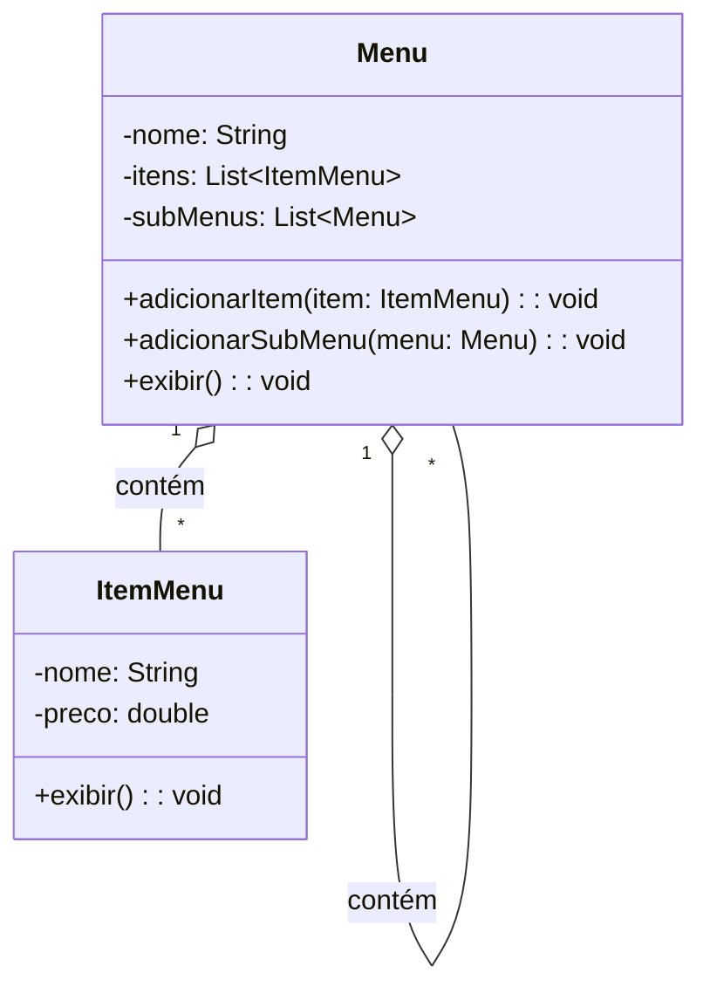
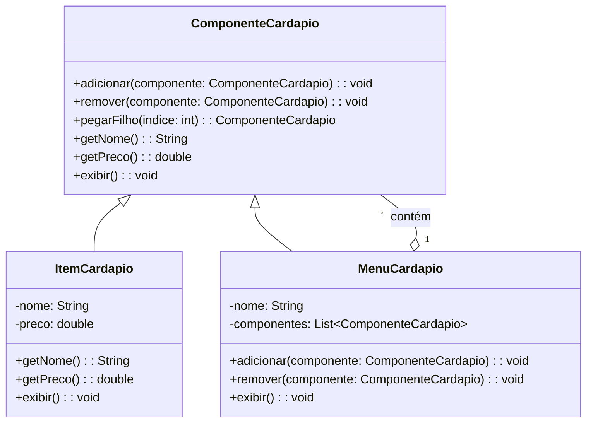

# Composite

## Intenção
Compor objetos em estruturas de árvore para representar hierarquias parte-todo. O padrão Composite permite que clientes tratem objetos individuais e composições de objetos de maneira uniforme.

## Também conhecido como
Parte-todo (Part-Whole)

## Motivação
Imagine que você está desenvolvendo o sistema de um restaurante, e o cliente pediu um **cardápio digital** para exibir aos clientes.

### Situação inicial:
No início, o cardápio é simples, contendo apenas **itens individuais**, como "Hambúrguer", "Refrigerante", "Sorvete".  
A estrutura era direta: uma lista simples de itens.

Porém, com o tempo, o restaurante começou a crescer, e o dono pediu:
- Categorias no cardápio, como *Lanches*, *Bebidas*, *Entradas* e *Sobremesas*.
- Subcategorias, como *Sucos Naturais* dentro de *Bebidas*.
  
Agora você tem uma **estrutura hierárquica**, com menus dentro de menus, além dos itens individuais.  
O código sem Composite começou a ficar complicado, pois o cliente (código que usa o cardápio) precisava saber se estava lidando com um item ou um menu, usando condicionais (if / else).

### Exemplo da hierarquia:
```
Menu Principal
├── Lanches
│   ├── Hambúrguer - R$ 15.00
│   ├── Cheeseburger - R$ 17.00
│   ├── Hot Dog - R$ 12.00
├── Bebidas
│   ├── Refrigerante - R$ 5.00
│   ├── Suco Natural - R$ 7.00
├── Entradas
│   ├── Batata Frita - R$ 10.00
│   ├── Onion Rings - R$ 9.00
│   ├── Nachos - R$ 11.00
└── Sobremesas
    ├── Sorvete - R$ 8.00
    ├── Bolo de Chocolate - R$ 10.00
    ├── Pudim - R$ 6.00
    ├── Torta de Limão - R$ 9.00
```

## Solução com Composite:
O padrão Composite resolve o problema ao permitir que **menus compostos** e **itens simples** sejam tratados da mesma maneira.  
Assim:
- Podemos adicionar menus e submenus recursivamente.
- O cliente não precisa se preocupar em diferenciar itens de menus.
- A manipulação da estrutura do cardápio fica simples, flexível e extensível.

## Estrutura

### Antes do Composite


### Depois com Composite


## Implementação:

### Código com Composite
```java
package ComComposite;

public class RestauranteComComposite {

    public static void main(String[] args) {

        MenuComponent menuPrincipal = new Menu("Menu Principal");

        MenuComponent lanches = new Menu("Lanches");
        lanches.add(new MenuItem("Hambúrguer", 15.00));
        lanches.add(new MenuItem("Cheeseburger", 17.00));
        lanches.add(new MenuItem("Hot Dog", 12.00));
        menuPrincipal.add(lanches);

        MenuComponent bebidas = new Menu("Bebidas");
        bebidas.add(new MenuItem("Refrigerante", 5.00));
        bebidas.add(new MenuItem("Suco Natural", 7.00));
        menuPrincipal.add(bebidas);

        MenuComponent entradas = new Menu("Entradas");
        entradas.add(new MenuItem("Batata Frita", 10.00));
        entradas.add(new MenuItem("Onion Rings", 9.00));
        entradas.add(new MenuItem("Nachos", 11.00));
        menuPrincipal.add(entradas);

        
        MenuComponent sobremesas = new Menu("Sobremesas");
        sobremesas.add(new MenuItem("Sorvete", 8.00));
        sobremesas.add(new MenuItem("Bolo de Chocolate", 10.00));
        sobremesas.add(new MenuItem("Pudim", 6.00));
        sobremesas.add(new MenuItem("Torta de Limão", 9.00));
        menuPrincipal.add(sobremesas);

        menuPrincipal.display();
    }
}
```

## Conclusão
O padrão Composite é essencial para **estruturas hierárquicas**, permitindo que objetos simples e compostos sejam tratados uniformemente.  
No cenário do restaurante, ele facilitou a gestão de **menus e itens**, tornando o sistema mais **flexível**, **escalável** e **fácil de manter**.  
Agora, não importa se é um item ou um submenu, o cliente só chama o método display() e o padrão faz o trabalho pesado.

## Usos conhecidos:
- **Sistemas de arquivos**: onde diretórios contêm arquivos e outros diretórios.
- **Organogramas de empresas**: onde departamentos contêm funcionários ou outros departamentos.
- **Menus em aplicações gráficas**: com submenus aninhados e itens de menu.

## Padrões relacionados:
- **Decorator:** Adiciona responsabilidades a objetos dinamicamente, mas não representa hierarquias.
- **Composite + Iterator:** Juntos permitem navegar por uma estrutura composta de maneira uniforme.
- **Flyweight:** Compartilha objetos similares para economia de memória, pode ser usado junto ao Composite em estruturas muito grandes.

## Referências
GAMMA, Erich; HELM, Richard; JOHNSON, Ralph; VLISSIDES, John. Padrões de projeto: soluções reutilizáveis de software orientado a objetos. 1. ed. Porto Alegre: Bookman, 2000.

