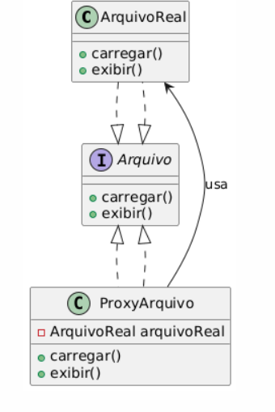

# Proxy

## Intenção
Fornecer um substituto ou intermediário para controlar o acesso a um objeto. O Proxy atua como um representante do objeto real, permitindo adicionar lógica adicional antes ou depois das chamadas ao objeto original, como controle de acesso, carregamento sob demanda ou cache.

## Também conhecido como
Surrogate

## Motivação
Imagine que um sistema de armazenamento em nuvem precisa fornecer acesso a arquivos grandes. Se cada solicitação acessasse diretamente os arquivos na nuvem, poderia haver um alto custo em desempenho e tempo de resposta. Para otimizar esse acesso, podemos usar o padrão Proxy para carregar os arquivos sob demanda e armazená-los temporariamente.

Sem o Proxy, cada vez que um cliente solicita um arquivo, a operação pode ser cara e demorada. O Proxy pode intermediar essas solicitações, verificando permissões, armazenando arquivos acessados recentemente e otimizando chamadas.

## Solução com Proxy:
O padrão Proxy resolve o problema ao intermediar o acesso ao objeto real, permitindo controle sobre sua criação, acesso e manipulação. Assim:

- Podemos adiar a criação do objeto real até que seja realmente necessário.
- Podemos adicionar um cache ou verificação de permissões antes de permitir o acesso ao objeto real.
- Podemos limitar o acesso ao objeto real baseado em regras de negócio.

## Use o padrão Proxy quando:

- Desejar controlar o acesso a um objeto real, por exemplo, restringindo, monitorando ou adiando sua inicialização.
- Precisar adicionar funcionalidades como logging, caching ou autenticação antes de permitir a interação com o objeto real.
- O acesso ao objeto real for muito dispendioso em termos de recursos e desempenho.

## Estrutura


## Participantes:
- Subject (Arquivo): Define a interface comum para RealSubject e Proxy.
- RealSubject (ArquivoReal): Implementa o comportamento real.
- Proxy (ProxyArquivo): Controla o acesso a RealSubject, podendo armazenar referências e gerenciar chamadas.

## Colaborações:
- O Proxy gerencia o acesso ao RealSubject, podendo delegar chamadas ou adicionar funcionalidade extra.

## Consequências:
- Controle sobre a criação do objeto: O objeto real só é instanciado quando necessário.
- Melhoria no desempenho: Pode reduzir chamadas a recursos dispendiosos (ex: carregamento de arquivos remotos).
- Segurança e acesso controlado: Pode restringir acesso com autenticação e permissões.

## Implementação:

- Proxy Virtual: Utilizado para adiar a criação do objeto real.
- Proxy Remoto: Representa um objeto em outra localização, como um serviço remoto.
- Proxy de Proteção: Controla acesso baseado em permissões.
- Proxy Cache: Armazena dados para evitar recomputações desnecessárias.

## Exemplo:

Classe Arquivo - Subject:
```java
package proxy;

public interface Arquivo {
    void carregar();
    void exibir();
}
```

Classe ArquivoReal - RealSubject:
```java
package proxy;

public class ArquivoReal implements Arquivo {
    private String nome;

    public ArquivoReal(String nome) {
        this.nome = nome;
        carregar();
    }

    @Override
    public void carregar() {
        System.out.println("Carregando arquivo: " + nome);
    }

    @Override
    public void exibir() {
        System.out.println("Exibindo arquivo: " + nome);
    }
}
```

Classe ProxyArquivo - Proxy:
```java
package proxy;

public class ProxyArquivo implements Arquivo {
    private ArquivoReal arquivoReal;
    private String nome;

    public ProxyArquivo(String nome) {
        this.nome = nome;
    }

    @Override
    public void carregar() {
        if (arquivoReal == null) {
            arquivoReal = new ArquivoReal(nome);
        }
    }

    @Override
    public void exibir() {
        carregar();
        arquivoReal.exibir();
    }
}
```

Classe Main - Cliente:
```java
package proxy;

public class Main {
    public static void main(String[] args) {
        Arquivo arquivo = new ProxyArquivo("documento.pdf");
        arquivo.exibir(); // Carrega e exibe
        System.out.println("---");
        arquivo.exibir(); // Apenas exibe, sem carregar novamente
    }
}
```

## Conclusão
O padrão Proxy é útil para controlar o acesso a objetos reais, permitindo otimizações como carregamento sob demanda, caching, autenticação e restrição de acesso. No exemplo apresentado, o Proxy adia a criação de um arquivo até que ele seja realmente necessário, evitando desperdício de recursos.

## Usos conhecidos:
**Serviços remotos:** Representa objetos remotos em aplicações distribuídas.

**Autenticação e segurança:** Restringe acesso a objetos sensíveis.
Cache de imagens e arquivos: Evita carregamento repetitivo de recursos.

**Controle de acesso a sistemas complexos:** Garante que apenas usuários autorizados interajam com determinados objetos.

## Padrões relacionados:
**- Decorator:** Embora similar ao Proxy, o Decorator adiciona funcionalidades sem restringir acesso.

**- Adapter:** Converte interfaces sem atuar como intermediário.

## Referências
GAMMA, Erich; HELM, Richard; JOHNSON, Ralph; VLISSIDES, John. Padrões de projeto: soluções reutilizáveis de software orientado a objetos. 1. ed. Porto Alegre: Bookman, 2000.

