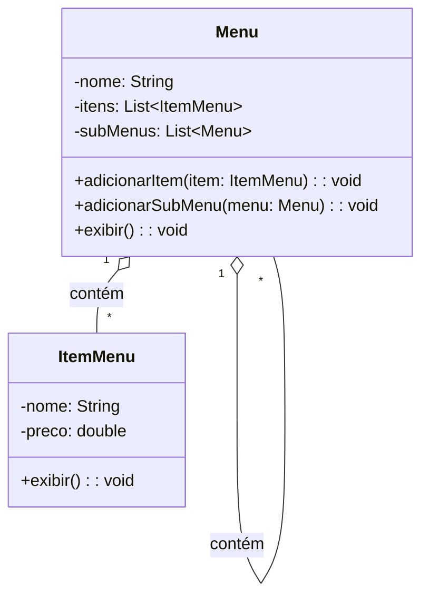
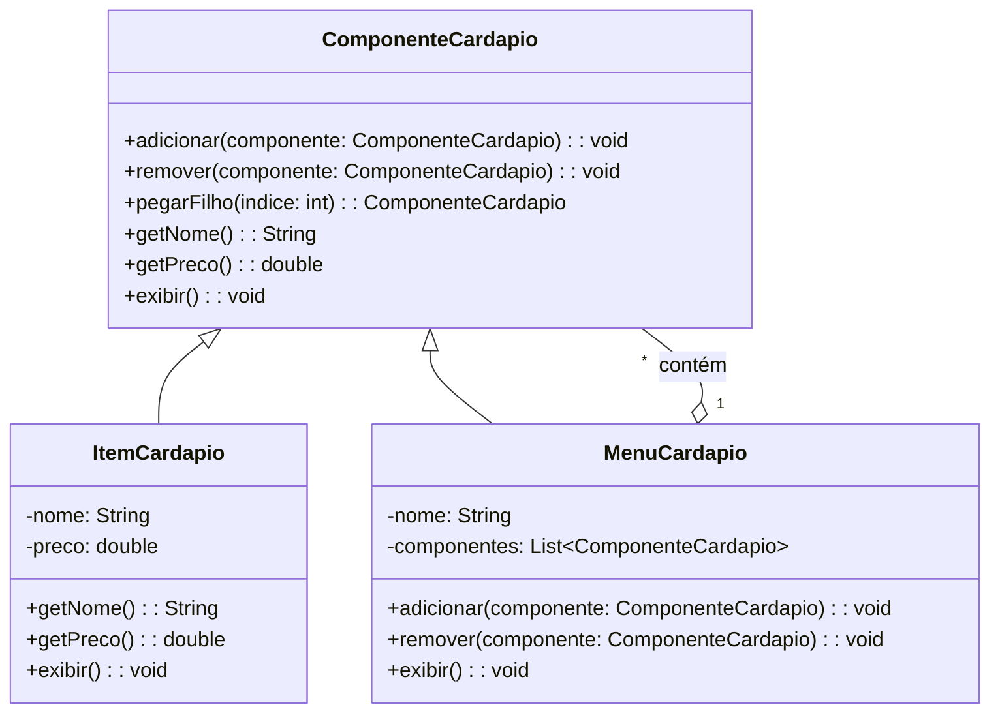

# Composite

## Intenção
Compor objetos em estruturas de árvore para representar hierarquias parte-todo. O padrão Composite permite que clientes tratem objetos individuais e composições de objetos de maneira uniforme.

## Também conhecido como
Parte-todo (Part-Whole)

## Motivação
Imagine que você está desenvolvendo o sistema de um restaurante, e o cliente pediu um **cardápio digital** para exibir aos clientes.

### Situação inicial:
No início, o cardápio é simples, contendo apenas **itens individuais**, como "Hambúrguer", "Refrigerante", "Sorvete".  
A estrutura era direta: uma lista simples de itens.

Porém, com o tempo, o restaurante começou a crescer, e o dono pediu:
- Categorias no cardápio, como *Bebidas* e *Sobremesas*.
- Subcategorias, como *Sucos Naturais* dentro de *Bebidas*.
  
Agora você tem uma **estrutura hierárquica**, com menus dentro de menus, além dos itens individuais.  
O código sem Composite começou a ficar complicado, pois o cliente (código que usa o cardápio) precisava saber se estava lidando com um item ou um menu, usando condicionais (`if` / `else`).

### Exemplo da hierarquia desejada:
```
Menu Principal
├── Hambúrguer - R$ 15.00
├── Refrigerante - R$ 5.00
└── Sobremesas
    ├── Sorvete - R$ 8.00
    └── Bolo de Chocolate - R$ 10.00
```

## Solução com Composite:
O padrão Composite resolve o problema ao permitir que **menus compostos** e **itens simples** sejam tratados da mesma maneira.  
Assim:
- Podemos adicionar menus e submenus recursivamente.
- O cliente não precisa se preocupar em diferenciar itens de menus.
- A manipulação da estrutura do cardápio fica simples, flexível e extensível.

## Use o padrão Composite quando:

- Deseja representar **estruturas hierárquicas** (parte-todo), como menus, árvores de diretórios, organizações empresariais, etc.
- Precisa **tratar objetos simples e compostos de maneira uniforme**.
- Quer evitar a complexidade de múltiplas verificações de tipos (`if` / `else`), facilitando a manutenção e a extensão do código.

## Estrutura

### Antes do Composite


### Depois com Composite


## Participantes:
- **ComponenteCardapio (Componente abstrato):** Define a interface comum para os objetos simples (folhas) e compostos.
- **ItemCardapio (Folha):** Representa os itens simples do cardápio (exemplo: Hambúrguer, Refrigerante).
- **MenuCardapio (Composite):** Representa menus que podem conter outros menus e itens.

## Colaborações:
- O **MenuCardapio** gerencia seus componentes, podendo conter outros menus ou itens.  
- O cliente usa a interface **ComponenteCardapio** sem se preocupar com a implementação concreta (item ou menu).

## Consequências:
- **Facilidade de uso:** O cliente trata menus e itens de forma uniforme.
- **Flexibilidade:** É possível adicionar submenus ilimitadamente.
- **Manutenção facilitada:** Não há necessidade de código específico para lidar com menus ou itens separadamente.
- **Expansão sem dor:** Novos tipos de componentes podem ser adicionados sem impactar o cliente.

## Implementação:

### Antes (Sem Composite)
```java
Menu menuPrincipal = new Menu("Menu Principal");

ItemMenu item1 = new ItemMenu("Hambúrguer", 15.00);
ItemMenu item2 = new ItemMenu("Refrigerante", 5.00);

Menu sobremesas = new Menu("Sobremesas");
ItemMenu item3 = new ItemMenu("Sorvete", 8.00);

sobremesas.adicionarItem(item3);

menuPrincipal.adicionarItem(item1);
menuPrincipal.adicionarItem(item2);
menuPrincipal.adicionarSubMenu(sobremesas);

menuPrincipal.exibir();
```

### Depois (Com Composite)
```java
ComponenteCardapio menuPrincipal = new MenuCardapio("Menu Principal");

ComponenteCardapio item1 = new ItemCardapio("Hambúrguer", 15.00);
ComponenteCardapio item2 = new ItemCardapio("Refrigerante", 5.00);

ComponenteCardapio sobremesas = new MenuCardapio("Sobremesas");
sobremesas.adicionar(new ItemCardapio("Sorvete", 8.00));
sobremesas.adicionar(new ItemCardapio("Bolo de Chocolate", 10.00));

menuPrincipal.adicionar(item1);
menuPrincipal.adicionar(item2);
menuPrincipal.adicionar(sobremesas);

menuPrincipal.exibir();
```

## Conclusão
O padrão Composite é essencial para **estruturas hierárquicas**, permitindo que objetos simples e compostos sejam tratados uniformemente.  
No cenário do restaurante, ele facilitou a gestão de **menus e itens**, tornando o sistema mais **flexível**, **escalável** e **fácil de manter**.  
Agora, não importa se é um item ou um submenu, o cliente só chama o método `exibir()` e o padrão faz o trabalho pesado.

## Usos conhecidos:
- **Sistemas de arquivos**: onde diretórios contêm arquivos e outros diretórios.
- **Organogramas de empresas**: onde departamentos contêm funcionários ou outros departamentos.
- **Menus em aplicações gráficas**: com submenus aninhados e itens de menu.

## Padrões relacionados:
- **Decorator:** Adiciona responsabilidades a objetos dinamicamente, mas não representa hierarquias.
- **Composite + Iterator:** Juntos permitem navegar por uma estrutura composta de maneira uniforme.
- **Flyweight:** Compartilha objetos similares para economia de memória, pode ser usado junto ao Composite em estruturas muito grandes.

## Referências
GAMMA, Erich; HELM, Richard; JOHNSON, Ralph; VLISSIDES, John. Padrões de projeto: soluções reutilizáveis de software orientado a objetos. 1. ed. Porto Alegre: Bookman, 2000.
